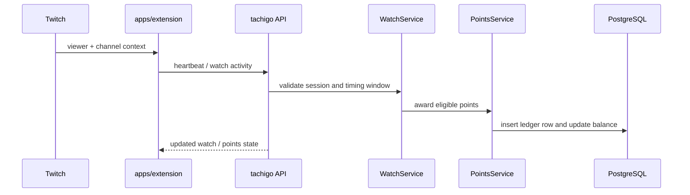
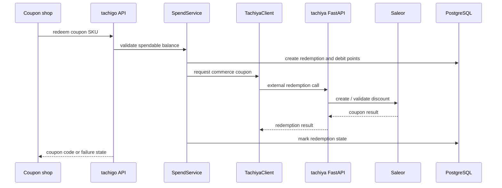

# 跨 Repo 流程

這頁只描述跨 major system 的主流程。細節仍回到 source、tests 與 domain docs。

## Twitch 觀看流程

P0 complete

| 邊界 | 原始碼 |
|---|---|
| Extension heartbeat | [`apps/extension/src/hooks/useHeartbeat.ts`](https://github.com/nurockplayer/tachigo/blob/develop/apps/extension/src/hooks/useHeartbeat.ts) |
| Extension API client | [`apps/extension/src/services/api.ts`](https://github.com/nurockplayer/tachigo/blob/develop/apps/extension/src/services/api.ts) |
| Watch handler | [`services/api/internal/handlers/watch_handler.go`](https://github.com/nurockplayer/tachigo/blob/develop/services/api/internal/handlers/watch_handler.go) |
| Watch service | [`services/api/internal/services/watch_service.go`](https://github.com/nurockplayer/tachigo/blob/develop/services/api/internal/services/watch_service.go) |
| Points service | [`services/api/internal/services/points_service.go`](https://github.com/nurockplayer/tachigo/blob/develop/services/api/internal/services/points_service.go) |
| Schema | [`003_watch_points.sql`](https://github.com/nurockplayer/tachigo/blob/develop/services/api/migrations/003_watch_points.sql), [`012_tachi_balances.sql`](https://github.com/nurockplayer/tachigo/blob/develop/services/api/migrations/012_tachi_balances.sql) |

審查重點：

- heartbeat debounce / cadence 是否避免 double credit。
- ledger insert 和 balance update 是否在同一個 consistency boundary。
- API 回傳型別是否仍符合 extension hook 的假設。

## 折扣碼兌換流程 {#coupon-redemption-flow}

P0 complete

| 邊界 | 原始碼 |
|---|---|
| Extension coupon panel | [`CouponShopPanel.tsx`](https://github.com/nurockplayer/tachigo/blob/develop/apps/extension/src/app/components/CouponShopPanel.tsx) |
| Extension redeem logic | [`redeemCouponForPanel.ts`](https://github.com/nurockplayer/tachigo/blob/develop/apps/extension/src/app/components/redeemCouponForPanel.ts), [`couponRedeem.ts`](https://github.com/nurockplayer/tachigo/blob/develop/apps/extension/src/app/couponRedeem.ts) |
| Spend handler | [`spend_handler.go`](https://github.com/nurockplayer/tachigo/blob/develop/services/api/internal/handlers/spend_handler.go) |
| Spend service | [`spend_service.go`](https://github.com/nurockplayer/tachigo/blob/develop/services/api/internal/services/spend_service.go) |
| tachiya client | [`tachiya_client.go`](https://github.com/nurockplayer/tachigo/blob/develop/services/api/internal/services/tachiya_client.go) |
| tachigo schema | [`019_coupon_redemptions.sql`](https://github.com/nurockplayer/tachigo/blob/develop/services/api/migrations/019_coupon_redemptions.sql) |
| tachiya repo | [`https://github.com/nurockplayer/tachiya`](https://github.com/nurockplayer/tachiya) |

Review focus:

- spend / redemption update 要能處理 tachiya timeout、retry 與 partial failure。
- external redemption id 應避免重複建立 coupon 或重複扣點。
- tachiya 連結使用 `master` 穩定路徑；未合併內容要用 commit permalink。

## 主播 / 經紀管理流程

P1 stub

_Coming soon._ 第一版先保留入口，後續補完整 dashboard → tachigo API → channel / agency state flow。

目前可先從這些檔案開始：

- [`apps/dashboard/src/pages/StreamersPage.tsx`](https://github.com/nurockplayer/tachigo/blob/develop/apps/dashboard/src/pages/StreamersPage.tsx)
- [`apps/dashboard/src/pages/StreamerDetailPage.tsx`](https://github.com/nurockplayer/tachigo/blob/develop/apps/dashboard/src/pages/StreamerDetailPage.tsx)
- [`services/api/internal/handlers/streamer_handler.go`](https://github.com/nurockplayer/tachigo/blob/develop/services/api/internal/handlers/streamer_handler.go)
- [`services/api/internal/services/agency_service.go`](https://github.com/nurockplayer/tachigo/blob/develop/services/api/internal/services/agency_service.go)
