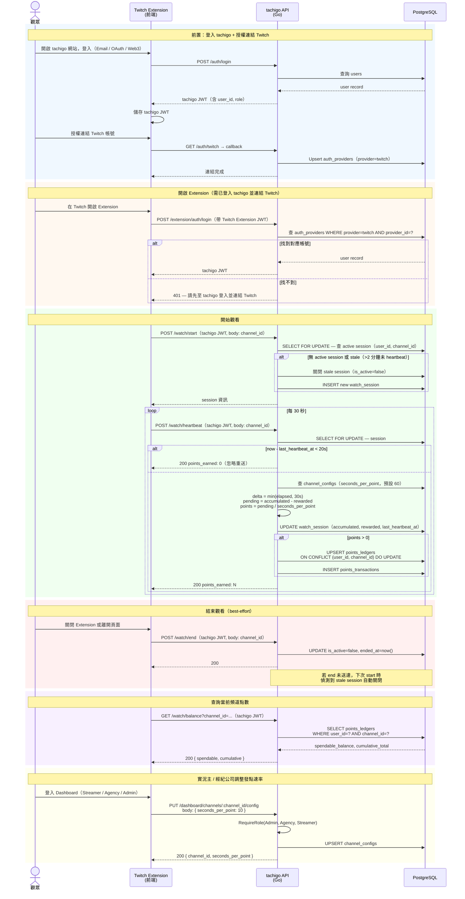

# tachigo 系統時序圖

> **最後更新：** 2026-04-01

---

```mermaid
sequenceDiagram
    actor Viewer as 觀眾
    participant FE as Twitch Extension<br/>(前端)
    participant API as tachigo API<br/>(Go)
    participant DB as PostgreSQL

    %% ── 1. 登入與授權 ────────────────────────────────
    rect rgb(240, 248, 255)
        Note over Viewer,DB: 前置：登入 tachigo + 授權連結 Twitch
        Viewer->>FE: 開啟 tachigo 網站，登入（Email / OAuth / Web3）
        FE->>API: POST /auth/login
        API->>DB: 查詢 users
        DB-->>API: user record
        API-->>FE: tachigo JWT（含 user_id, role）
        FE->>FE: 儲存 tachigo JWT

        Viewer->>FE: 授權連結 Twitch 帳號
        FE->>API: GET /auth/twitch → callback
        API->>DB: Upsert auth_providers（provider=twitch）
        API-->>FE: 連結完成
    end

    %% ── 2. Extension 開啟 ────────────────────────────
    rect rgb(255, 248, 240)
        Note over Viewer,DB: 開啟 Extension（需已登入 tachigo 並連結 Twitch）
        Viewer->>FE: 在 Twitch 開啟 Extension
        FE->>API: POST /extension/auth/login（帶 Twitch Extension JWT）
        API->>DB: 查 auth_providers WHERE provider=twitch AND provider_id=?
        alt 找到對應帳號
            DB-->>API: user record
            API-->>FE: tachigo JWT
        else 找不到
            API-->>FE: 401 — 請先至 tachigo 登入並連結 Twitch
        end
    end

    %% ── 3. 觀看計時 ──────────────────────────────────
    rect rgb(240, 255, 240)
        Note over Viewer,DB: 開始觀看
        FE->>API: POST /watch/start（tachigo JWT, body: channel_id）
        API->>DB: SELECT FOR UPDATE — 查 active session（user_id, channel_id）
        alt 無 active session 或 stale（>2 分鐘未 heartbeat）
            API->>DB: 關閉 stale session（is_active=false）
            API->>DB: INSERT new watch_session
        end
        API-->>FE: session 資訊

        loop 每 30 秒
            FE->>API: POST /watch/heartbeat（tachigo JWT, body: channel_id）
            API->>DB: SELECT FOR UPDATE — session
            alt now - last_heartbeat_at < 20s
                API-->>FE: 200 points_earned: 0（忽略重送）
            else
                API->>DB: 查 channel_configs（seconds_per_point，預設 60）
                API->>API: delta = min(elapsed, 30s)<br/>pending = accumulated - rewarded<br/>points = pending / seconds_per_point
                API->>DB: UPDATE watch_session（accumulated, rewarded, last_heartbeat_at）
                alt points > 0
                    API->>DB: UPSERT points_ledgers<br/>ON CONFLICT (user_id, channel_id) DO UPDATE
                    API->>DB: INSERT points_transactions
                end
                API-->>FE: 200 points_earned: N
            end
        end
    end

    %% ── 4. 結束觀看 ──────────────────────────────────
    rect rgb(255, 240, 240)
        Note over Viewer,DB: 結束觀看（best-effort）
        Viewer->>FE: 關閉 Extension 或離開頁面
        FE->>API: POST /watch/end（tachigo JWT, body: channel_id）
        API->>DB: UPDATE is_active=false, ended_at=now()
        API-->>FE: 200
        Note over API,DB: 若 end 未送達，下次 start 時<br/>偵測到 stale session 自動關閉
    end

    %% ── 5. 查詢餘額 ──────────────────────────────────
    rect rgb(248, 240, 255)
        Note over Viewer,DB: 查詢當前頻道點數
        FE->>API: GET /watch/balance?channel_id=...（tachigo JWT）
        API->>DB: SELECT points_ledgers<br/>WHERE user_id=? AND channel_id=?
        DB-->>API: spendable_balance, cumulative_total
        API-->>FE: 200 { spendable, cumulative }
    end

    %% ── 6. 管理端調整發點速率 ────────────────────────
    rect rgb(255, 255, 240)
        Note over Viewer,DB: 實況主 / 經紀公司調整發點速率
        Viewer->>FE: 登入 Dashboard（Streamer / Agency / Admin）
        FE->>API: PUT /dashboard/channels/:channel_id/config<br/>body: { seconds_per_point: 10 }
        API->>API: RequireRole(Admin, Agency, Streamer)
        API->>DB: UPSERT channel_configs
        API-->>FE: 200 { channel_id, seconds_per_point }
    end
```

---

## 相關文件

- [docs/watch-to-points-design.md](watch-to-points-design.md) — 發點系統詳細設計
- [docs/architecture.md](architecture.md) — 整體架構說明
