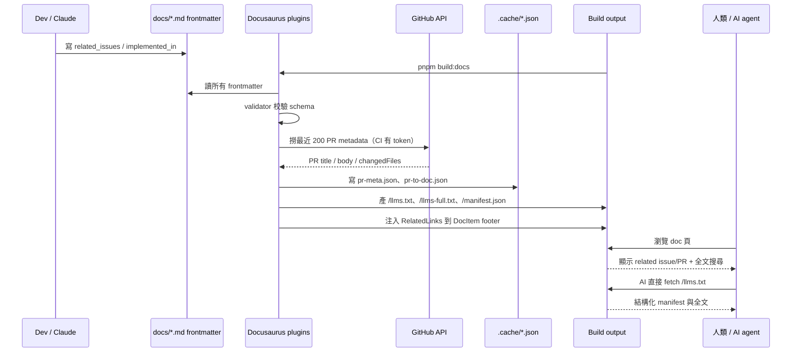

# tachigo Dev Portal — Phase 1 Link Layer 設計文件

**日期**：2026-05-14
**狀態**：proposed
**前置 spec**：[2026-05-14-project-atlas-design.md](./2026-05-14-project-atlas-design.md)（已 merge 並由 #679、#680 實作 P0）

---

## 背景

組長已於 #676、#679、#680 完成 tachigo Dev Portal 第一階段（Docusaurus app `apps/docs/`、6 個 P0 導覽頁、客製首頁、sidebar 結構、frontmatter schema、`docs/` markdown 全掛載到 `/tachigo/`）。

此 spec 接續 [`2026-05-14-project-atlas-design.md`](./2026-05-14-project-atlas-design.md) 中「後續可擴充」段落所列的方向：

- 加入搜尋索引與 owner tags
- 從 `graph.json` 產出 domain cards 或 impact path
- 提供 agent-friendly 結構化入口（原 spec 已聲明 source links 應讓 agent 容易引用）

本階段聚焦：**讓每份 doc 顯示其相關 issue / PR、提供 PR/issue → doc 反向索引、提供標準 AI manifest、補上全文搜尋**。不重做骨架、不搬檔、不引入新 app。

---

## 與前置 spec 非目標清單的對齊說明

前置 spec [`2026-05-14-project-atlas-design.md`](./2026-05-14-project-atlas-design.md) 中「不新增後端 API、資料庫或外部服務」一句，在本 spec 的語境下作如下釐清：

- **規範對象**：呈現層內容、AI inference、搜尋的「**hosted service**」（如 Algolia DocSearch、OpenAI、其他 SaaS chatbot 後端）。本 Phase 1 全部避開。
- **非規範對象**：靜態檔 **hosting**（如 GitHub Pages、Cloudflare Pages、Netlify）。任何靜態站台都需要 host，hosting 平台選擇是部署決策，與「不引入外部服務」非同一範疇。

部署 hosting 屬獨立決策，由 [PR 6 追蹤票 #699](https://github.com/nurockplayer/tachigo/issues/699) 另案處理，**不在 Phase 1 Link Layer 範圍內**。

## 不做（明確不在本 spec 範圍內）

- 不新增 app、不搬 `docs/` 檔案、不改動既有 6 個 Dev Portal 頁的 routing 與 sidebar
- 不新增 UI library
- 不做 AI chatbot（與原 spec 一致）
- 不引入外部 hosted search service（Algolia 等）
- 不重寫既有 doc 內容
- 不把 graphify 產物 commit 進 repo（沿用原 spec 決策）
- 不變更 `apps/docs` 的 `i18n` 設定、不增加新語系
- 不變更後端 API、schema、或 runtime 行為

---

## 使用者與場景

- **新同事**：在 doc 頁面底部直接看到「這份文件對應的設計 issue / 實作 PR」，不用切去 GitHub 自己搜。
- **日常開發者**：從 PR/issue 反向找回相關 doc；改 doc 時用 frontmatter 補連結。
- **AI agent**：透過 `/llms.txt`、`/llms-full.txt`、`/manifest.json` 一次取得 portal 結構與內容，不需 crawl 多頁。
- **架構 reviewer**：透過 frontmatter 校驗確保 doc 與實作 PR 之間的對應不漂移。

---

## 核心決策

| 問題 | 決策 |
|---|---|
| 在哪實作？ | 全部以 plugin / theme override / build script 形式長在現有 `apps/docs/` 內 |
| doc ↔ PR 關聯來源？ | 手動 frontmatter（canonical）+ build-time GitHub API 反查（補強） |
| AI manifest 格式？ | 標準 `llms.txt` + `llms-full.txt` + 客製 `manifest.json` |
| 搜尋方案？ | `@easyops-cn/docusaurus-search-local`（純前端、中文友善、無外部服務） |
| frontmatter schema 校驗？ | Build-time validator，欄位錯誤直接 build fail |
| PR 拆分？ | 5 個獨立 PR，每個 < 600 行；僅 PR 5 因 lockfile 可能申請 `scope-exception` label，其餘 PR 不得使用此 exception |

---

## 資訊架構與檔案結構

不變動 `docs/` 既有結構與 sidebar。所有新增物件位於 `apps/docs/`：

```
apps/docs/
├── docusaurus.config.ts          ← 註冊新 plugin
├── plugins/
│   ├── frontmatter-validator/    ← PR 1
│   ├── related-links/            ← PR 2
│   ├── reverse-index/            ← PR 3
│   └── llms-txt/                 ← PR 4
├── src/
│   ├── theme/
│   │   └── DocItem/Footer/       ← PR 2：swizzle 注入 RelatedLinks
│   └── components/
│       └── RelatedLinks.tsx      ← PR 2
└── .cache/
    ├── pr-meta.json              ← PR 3：GitHub API cache，commit 進 repo
    └── pr-to-doc.json            ← PR 3：反向索引產物，commit 進 repo
```

並新增一個 Dev Portal 頁面（PR 3）：

| 路徑 | 內容 |
|---|---|
| `docs/dev-portal/changelog.md` | 近期 PR 對應到哪些 doc 的列表（由 reverse-index plugin 在 build 時補資料） |

---

## Frontmatter Schema 擴充

組長現有欄位保留，向後相容新增以下可選欄位：

```yaml
# Doc ↔ PR / issue 關聯
related_issues: [674, 463]           # 對應的設計 / 討論 issue 號（純數字，不含 #）
implemented_in: [679, 680]           # 實作此 doc 的 PR 號（純數字，不含 #）
implemented_at: 2026-05-13           # 主要實作完成日；若省略由 plugin 從 PR mergedAt 補
impl_status: shipped                 # shipped | in_progress | proposed；省略時沿用既有 status

# Reverse-index 行為控制（Codex review M1 / Open Q2 修正）
reverse_index_mode: inferred         # inferred（預設）| explicit_only | disabled
reverse_index_scope: [services/api/internal/watchtime]  # 可選，覆蓋 code_areas 作為 reverse-index 推論用；每個值必須等於 code_areas 任一值或位於其 prefix 下

# llms.txt 內容控制
excluded_from_llms: false            # true 時手動 opt-out llms.txt
internal: false                      # true 時所有 AI manifest 都排除（未來擴充用 flag）
```

### 既有 doc frontmatter 現況（2026-05-14 audit）

對 `origin/develop` 的 `docs/` 目錄做過 frontmatter audit，結果如下：

| 類別 | 狀態 | 範例 |
|---|---|---|
| 完整 frontmatter（含 status/owner/last_reviewed） | 約 7 份 | `docs/index.md`、`docs/dev-portal/*.md` |
| **無 frontmatter** | 約 23 份 | `docs/ai/*`、`docs/auth-architecture.md`、`docs/pr-scope-policy.md` 等 |
| **僅 frontmatter 包圍但缺必填欄位** | 約 15 份 | `docs/architecture.md`、`docs/tokenomics.md`、`docs/superpowers/specs/*` 等 |

合計 ~38 份 doc 不符合「status/owner/last_reviewed 必填」的規則。若 PR 1 強制必填，會立刻擋下絕大多數既有 doc 並阻塞所有 Phase 1 後續 PR。

### Schema 校驗規則（PR 1）— B1 修正版

**全欄位 optional，但有填值的話必須符合型別**。第二輪再決定是否要逐步強制必填。

- `status`、`owner`、`last_reviewed`、`source_of_truth`、`code_areas`、`related_repos`：**optional**；型別錯誤才 fail
- `related_issues`、`implemented_in`：optional 陣列；元素必須為正整數
- `implemented_at`：optional；ISO date 字串
- `impl_status`：optional 列舉值
- `reverse_index_mode`：optional；`inferred | explicit_only | disabled`
- `reverse_index_scope`：optional 字串陣列；每個 path 必須等於 `code_areas` 任一值，或位於任一 `code_areas` prefix 下（例如 `services/api/internal/watchtime` 合法屬於 `services/api`）
- `excluded_from_llms`、`internal`：optional boolean
- 校驗使用 `zod`，validator 為 Docusaurus plugin
- 違規（型別錯誤）時 `pnpm build:docs` 直接 fail
- 缺欄位 / 完全無 frontmatter：**不 fail**（不影響既有 doc）

### 後續強化（不在 Phase 1）

未來若要把欄位從 optional 推升為 required，須先：

1. 開 `[backend]` audit issue：對 ~38 份既有 doc 逐一補欄位
2. 全部補齊並 merge 後，PR n+1 才升 schema 為 required

向後相容：所有現有 doc 不含新欄位 / 完全無 frontmatter 時 build 仍通過；新欄位錯型別才 fail。

---

## 元件設計

### PR 1：`frontmatter-validator` plugin

**實作介面（Codex review Major 3 修正）**：

不依賴 Docusaurus `loadContent` lifecycle（該 hook 只給 plugin 自己的 content，不會自動拿到 docs plugin 載入的 frontmatter，容易實作成 no-op 通過但實際沒掃任何 doc）。改為：

- Plugin export `loadContent()` 直接以 Node `fs` + `gray-matter` 讀取 `docsRoot`（建議由 plugin options 注入，預設以 `context.siteDir` 推回 repo root 的 `docs/`），再用 `fast-glob` / `glob` 掃 `**/*.md`
- 遍歷找到的 markdown，解析 frontmatter
- 用 `zod` schema 校驗每份 doc 的 frontmatter
- 校驗失敗時 throw error，附 doc 路徑 + 違規欄位 + 期望型別，build fail
- 校驗通過時把結果存進 plugin global data 供 PR 2 / PR 3 / PR 4 重用（避免每個 plugin 都掃一遍 filesystem）

**負例測試（fixture）**：

PR 1 必須含一個 fixture test，確認 plugin 真的掃到所有 doc 而非 no-op 通過：

- 在 `apps/docs/plugins/frontmatter-validator/__tests__/` 加 fixture `bad-frontmatter.md`，故意填 `related_issues: ["foo"]`
- 跑 plugin 直接驗證會 throw 預期錯誤
- 移除 fixture 後跑 `pnpm build:docs` 驗證通過

**為什麼不用 docs plugin 的 metadata**：

Docusaurus docs plugin 在 `contentLoaded()` 之後才有完整 metadata，但屆時 build 已半完成，校驗失敗的成本與訊息位置都不理想。直接 filesystem 讀取在 build 開始時即執行，錯誤訊息清楚，且不耦合 docs plugin 內部結構（未來 Docusaurus 升版較不易壞）。

**Flags**：

- 提供 `--allow-warnings` flag 給本機開發階段（CI 不傳此 flag）

### PR 2：`related-links` plugin + `RelatedLinks` component + DocItem Footer swizzle

**範圍縮減（Codex review Major 4 修正）**：

原本 spec 同時要求顯示 title / state / mergedAt，與 issue #695「不打 GitHub API、僅顯示 chip + 連結」矛盾。為避免 PR 2 擴張 scope 且引入 API/cache 問題，PR 2 縮減為「**僅 chip + 連結**」，title / state / mergedAt 等 metadata 由 PR 3 reverse-index plugin 統一從 GitHub API 撈出後注入 global data，PR 2 不重複撈。

- Plugin 把 frontmatter 中的 `related_issues`、`implemented_in` 透過 `setGlobalData` 注入（純數字陣列）
- 自訂 `RelatedLinks.tsx` 元件顯示：
  - 標題「相關 issue」「實作 PR」（兩個區塊分列）
  - 每個 issue/PR：`#<num>` chip 連到 `https://github.com/nurockplayer/tachigo/{issues,pull}/<num>`
  - **不顯示** title / state / mergedAt（不打 GitHub API、不依賴 cache）
- Swizzle `theme/DocItem/Footer`，於原 footer 之上插入 `<RelatedLinks />`
- 沒填 frontmatter 的 doc 不渲染區塊（不出現空容器）

**PR 3 升級**：

PR 3 build-reverse-index script 已會撈 PR title / mergedAt / additions / deletions 並存 cache。PR 3 完成後可回頭擴 RelatedLinks 元件用此 cache 顯示更豐富 metadata，但這屬 PR 3b 範圍，不在 PR 2。

### PR 3：`reverse-index` plugin + Node script

- Node script `apps/docs/scripts/build-reverse-index.ts`：
  - 經 GitHub REST API 撈最近 N=200 個已 merge PR（可調）
  - 對每個 PR：取 `title`、`body`、`changedFiles` paths
  - 與所有 doc 的 `code_areas`、檔案路徑比對

**命中規則（加權，M2 + Codex review M1 修正版）**：

| 規則 | Weight | 範例 |
|---|---|---|
| PR `body` 明確提及 doc 路徑（例如 `docs/architecture.md`） | 1.0 | strong evidence |
| PR `title` 明確提及 doc topic 關鍵字（doc 檔名去副檔名後的 slug） | 0.6 | medium evidence |
| PR `changedFiles` 路徑 ≥ 2 層 prefix-match `code_areas`（例如 `services/api/auth/` match `services/api/auth`） | 0.5 | medium evidence |
| PR `changedFiles` 路徑只在 `code_areas` 第一層 prefix-match（例如 `services/api/` match `services/api`） | 0.2 | weak evidence |

- 只顯示 weight ≥ 0.5 的關聯，避免 architecture.md 這類「整體架構」doc 被 services/api 下所有 PR 淹沒
- weight ≥ 1.0 標為「strong」，0.5–0.99 標為「medium」，UI 上可選擇是否顯示 medium

**Broad-scope opt-out（Codex review Major 1 修正）**：

Dev Portal 導覽頁與根入口頁的 `code_areas` 是「站台 / 系統入口」性質（例如 `[services/api, apps/extension, apps/dashboard]`），同樣的 changedFiles 推論規則會讓幾乎所有 backend / frontend PR 都被誤推到首頁與導覽頁。為避免此情況：

- 新增 frontmatter 欄位 `reverse_index_mode`（optional）：
  - `inferred`（預設）：用 PR body / title / changedFiles 三條規則加權
  - `explicit_only`：**只接受 PR body 明確提及 doc 路徑**（weight 1.0），忽略 title / changedFiles
  - `disabled`：完全不參與 reverse-index
- **預設 `explicit_only`** 的 doc：
  - `docs/index.md`
  - `docs/dev-portal/*.md`（所有 Dev Portal 導覽頁）
- 其他 doc 不寫此欄位時走 `inferred`
- Validator（PR 1）需校驗此欄位為合法 enum

**`code_areas` 雙用途分離（Codex Open Question 2）**：

原本 `code_areas` 同時供 Source Index 與 reverse-index inference 使用。為避免廣域 entry-point doc 把入口列表設成大範圍後又被 reverse-index 誤配，新增可選欄位 `reverse_index_scope`：

- 若有 `reverse_index_scope`，reverse-index 推論用此欄位（每個值必須等於 `code_areas` 任一值，或位於任一 `code_areas` prefix 下；validator 校驗）
- 若無，沿用 `code_areas` 並依 `reverse_index_mode` 決定推論強度

範例：

```yaml
# docs/dev-portal/domain-maps.md
code_areas: [services/api, apps/extension, apps/dashboard]  # AI / Source Index 用
reverse_index_mode: explicit_only                            # broad-scope opt-out
```

```yaml
# docs/watch-to-points-design.md（聚焦於 watch / points 邏輯）
code_areas: [services/api]
reverse_index_scope: [services/api/internal/watchtime, services/api/internal/points]
```

- 產 `apps/docs/.cache/pr-to-doc.json`，內容：`{ "docs/architecture.md": [{pr: 679, title, mergedAt, additions, deletions, weight: 0.6, reasons: ["title"]}], ... }`
- cache 落地 commit 進 repo；本地無 token 時 fallback 用 cache
- Plugin 把 `pr-to-doc.json` 注入 global data
- 新頁 `docs/dev-portal/changelog.md` 用 MDX 拉 global data 渲染近 90 天 PR → doc 對應

### PR 3 工程量警示（M1）

PR 3 同時涵蓋 Node script、GitHub API 整合、cache schema、Docusaurus plugin、MDX 頁面、與 RelatedLinks 元件整合。實估 500–700 行，**可能超過 600 軟警告**。若工作中發現超過，按 PR 拆分檢查標準分拆為：

- **PR 3a**：`build-reverse-index` script + cache schema + JSON 落地（不含 UI），估 ~250 行
- **PR 3b**：`reverse-index` plugin + `changelog.md` 頁 + RelatedLinks 「inferred」區整合，估 ~300 行

PR 3a 必須先於 PR 3b 進。

GitHub API 規範：

- CI 用 `GITHUB_TOKEN`（GitHub Actions 內建）
- 本地 dev 用 `GH_TOKEN` env var；無 token 時不重撈、直接讀 cache
- API 失敗時 build 不 fail，但 console 印 warning 並標記 cache 為 stale

### PR 4：`llms-txt` plugin

**內容過濾（M3 + Codex review M2 修正）**：

`docs/dev-portal/source-index.md` 已明確把若干根目錄 doc 列為「Root source of truth」（如 `architecture.md`、`auth-architecture.md`、`watch-to-points-design.md`、`tokenomics.md`），但這些核心 doc 多數沒有標準 frontmatter。若採嚴格白名單，AI manifest 會排除 agent 最需要的核心文件。修正採三層 fallback：

**Tier 1 — 明確允許**（必納入）：

- frontmatter 含 `status: active` 的 doc
- 或 frontmatter 含 `source_of_truth: true` 的 doc
- 或 doc 位於 `docs/dev-portal/` 目錄下

**Tier 2 — Root source-of-truth fallback**（無 frontmatter 但仍必納入）：

- 在 `docs/dev-portal/source-index.md` § "Root source of truth" 表內被引用的 doc 路徑（如 `architecture.md`、`auth-architecture.md`、`watch-to-points-design.md`、`tokenomics.md`、`pr-scope-policy.md` 等）
- 由 `llms-txt` plugin build 時解析 `source-index.md` 取得清單，避免硬編碼
- 解析方式：抓 `docs/dev-portal/source-index.md` 內第一個 "Root source of truth" 表的 markdown link，取 `/tachigo/` 後的 slug 反推回 doc 路徑
- 解析失敗時 plugin 警告但不 fail（仍輸出 Tier 1 內容）

**Tier 3 — 明確排除**：

- `docs/superpowers/specs/` 內 `status: proposed` / `status: deprecated` 的 doc
- `docs/superpowers/plans/` 整個目錄
- 任何 `status: deprecated`
- 任何含 `internal: true` frontmatter flag 的 doc
- 任何含 `excluded_from_llms: true` 的 doc（手動 opt-out）

**未列上述任一 Tier 的 doc**（例如有 frontmatter 包圍但無 status、且不在 Source Index Root 表）：預設 **不** 進 llms.txt。Doc 作者要進 llms.txt 須補 `status: active` 或在 Source Index Root 表加引用。

**驗收依賴**：PR 4 需 fixture 驗證 llms.txt 含 `architecture.md`、`auth-architecture.md`、`watch-to-points-design.md`、`tokenomics.md`，且排除 `docs/superpowers/plans/` 與任何 proposed spec。

- Build-time hook，遍歷所有 doc，產出三份檔案到 `apps/docs/build/`：

**`/llms.txt`**（標準格式，每頁一行）：
```
# tachigo Dev Portal

> tachigo / tachiya 專案導覽入口

## Architecture
- [System Architecture](/tachigo/architecture): tachigo 系統整體架構與主要資料流
- [Auth Architecture](/tachigo/auth-architecture): Auth 現況與 migration guardrails
...
```

**`/llms-full.txt`**：所有 doc 的 markdown 內文按 sidebar 順序拼接，每頁前加 `---` 分隔與來源 URL。

**`/manifest.json`**：結構化版本，每個 doc 一筆：
```json
{
  "version": "1.0",
  "generated_at": "2026-05-14T00:00:00Z",
  "docs": [
    {
      "path": "/tachigo/architecture",
      "title": "...",
      "status": "active",
      "owner": "engineering",
      "code_areas": ["services/api"],
      "related_issues": [...],
      "implemented_in": [...]
    }
  ]
}
```

### PR 5：本地全文搜尋

**首選**：`@easyops-cn/docusaurus-search-local`

- 設定 `language: ['en', 'zh']`、`hashed: true`、`highlightSearchTermsOnTargetPage: true`
- 不接 Algolia、不外傳任何資料

**供應鏈 / native binding 風險（M4）**：

此套件中文切詞底層使用 `nodejieba`（C++ native binding，需編譯）。CI 上的 `supply-chain-check`（組長 #679 已啟用）可能擋下，且 build 時間會增加。PR 5 必須在開工前先在本地驗證：

1. 跑 `pnpm add @easyops-cn/docusaurus-search-local` 後 `pnpm install` 不出 native build 失敗
2. 跑 `make supply-chain-check` 通過
3. 跑 `pnpm build:docs` 通過、搜尋功能正常

**Fallback（若首選擋下）**：

| 順序 | 套件 | 中文切詞 | native binding | 取捨 |
|---|---|---|---|---|
| 1 | `@easyops-cn/docusaurus-search-local` | nodejieba（佳） | 是 | 切詞最好但 supply-chain 風險 |
| 2 | `docusaurus-search-local`（社群 fork） | 簡易 | 否 | 純 JS，中文切詞較粗但無 supply-chain 風險 |
| 3 | `docusaurus-lunr-search` | 無內建中文切詞 | 否 | 英文文件適用，中文體驗差 |

若首選擋下，採方案 2 並在 spec 與 issue 註明退路理由。方案 3 為兜底但不推薦（中文體驗差）。

---

## 資料流



---

## 錯誤與風險處理

| 風險 | 處理方式 |
|---|---|
| frontmatter 填錯 issue/PR 號 | validator 校驗為正整數；GitHub API 撈不到時 RelatedLinks 顯示 placeholder 與 warning |
| GitHub API rate limit | CI 用 `GITHUB_TOKEN`（5000/hr）；本地 fallback cache |
| API 失敗 build 失敗 | API 失敗只警告不 fail；cache stale 標記為 `stale: true` |
| `pnpm-lock.yaml` 又被 search 套件撐大 | PR 5 改動限定一個套件，預期 lock diff 在 600–1500 行區間；若超過 PR 5 申請 `scope-exception` label，理由：single workspace 加 search 依賴。其他 PR 不可使用此 exception |
| AI manifest 內容洩漏未發佈內容 | manifest 只包含 doc 內容；不含 PR body / draft / private notes |
| Reverse index 命中錯誤（false positive） | UI 上把 reverse-index 結果與 frontmatter 結果分區呈現，frontmatter 為「authoritative」、reverse-index 為「inferred」並標示 |
| 既有 doc frontmatter 不齊 | 新欄位皆可選；既有 doc build 不破 |
| `apps/docs/.cache/*.json` commit 進 repo 造成 PR noise | cache 落地檔案在 CI 後台自動 PR 更新（每週 cron + 手動 dispatch），與正常 feature PR 區隔 |

---

## 驗收標準

第一階段交付完成時：

- 任意 doc 加上 `related_issues: [674]` 後，瀏覽該頁能看到對應 issue 的 chip 與 GitHub 連結
- `pnpm build:docs` 對所有現有 doc 通過（含完全無 frontmatter 的舊 doc）
- 故意填入 `related_issues: ["foo"]` 會讓 build fail，錯誤訊息明確指出哪份 doc 哪個欄位
- `https://nurockplayer.github.io/tachigo/llms.txt` 可訪問，符合 [llms.txt](https://llmstxt.org) 結構（單一 H1、blockquote 簡介、H2 sections、每行 `- [title](url): description`）
- `https://nurockplayer.github.io/tachigo/manifest.json` 為合法 JSON，**涵蓋所有符合 PR 4 Tier 1 + Tier 2 過濾條件的 doc**；不使用固定數量門檻，改以必含 / 必排除清單驗證（包含 Source Index Root source-of-truth 表列出的無 frontmatter 核心 doc；排除 proposed / plans / deprecated / internal / excluded_from_llms）
- 站台右上有搜尋框，輸入「watch points」可命中 `docs/watch-to-points-design.md`
- 中文輸入「點數」可命中 `docs/watch-to-points-design.md` 與 `docs/tokenomics.md`（具體 doc 名）
- `docs/dev-portal/changelog.md` 列出近 90 天 PR 與其對應 doc，每條附 weight 與 reason
- reverse-index 對 `docs/architecture.md` 的命中數 ≤ 5 條（避免被 services/api 下所有 PR 淹沒）

---

## PR 拆分計畫

### Spec 路線（M5 修正）

Spec 自己一張 `[discussion]` PR（路線 A，與組長 #676 模式一致），不與 PR 1 綁定：

- **PR 0（spec）**：`[discussion] dev-portal: Phase 1 Link Layer 設計規格`，只含 `docs/superpowers/specs/2026-05-14-dev-portal-link-layer-design.md`，估 ~350 行。Reviewer 專注審設計決策，不被程式碼分散注意力。

### 實作 PR

| 順序 | PR title | 範圍 | 估行數 | 依賴 | scope-exception |
|---|---|---|---|---|---|
| 1 | `[frontend] dev-portal: add frontmatter schema validator` | `apps/docs/plugins/frontmatter-validator/` + zod 依賴。全欄位 optional（B1） | ~200 | PR 0 merge | 不需要 |
| 2 | `[frontend] dev-portal: render related issues and PRs on doc pages` | `related-links` plugin + `RelatedLinks` 元件 + DocItem footer swizzle | ~300 | PR 1 | 不需要 |
| 3 | `[frontend] dev-portal: reverse index from PRs to docs`（**可能拆成 3a / 3b，見 PR 3 工程量警示**） | `reverse-index` plugin + Node script + `changelog.md` 新頁 | ~500–700 | PR 1 | 不需要；若拆 3a/3b 各 ~250–300 行 |
| 4 | `[frontend] dev-portal: emit llms.txt and manifest.json` | `llms-txt` plugin + 內容過濾規則 | ~250 | PR 1 | 不需要 |
| 5 | `[frontend] dev-portal: add local full-text search` | 接 search 套件 + 設定 + supply-chain 驗證 | ~100 + lockfile | — | **可能需要（lockfile）**，理由：單一 search 套件依賴鏈撐 lockfile |

順序建議：**PR 0 → PR 1 → (PR 2 ‖ PR 3a ‖ PR 4 ‖ PR 5) → PR 3b（若分拆）**。

每個 PR 各自開 `[frontend]` issue（PR 0 用 `[discussion]`），附 Acceptance Criteria checklist 與測試方式說明。

---

## 測試 / Fixture 計畫（Codex review Test Gaps）

每個 PR 需要的測試 / fixture 覆蓋：

### PR 1：frontmatter validator

- **正例**：所有 `docs/**/*.md` 跑 plugin `loadContent()` 不 throw
- **掃描範圍正例**：fixture 或 integration test assert validator 至少掃到 `docs/index.md`，避免 glob/path 設錯時 no-op 通過
- **負例 fixture**：在 `__tests__/fixtures/bad-frontmatter.md` 故意填 `related_issues: ["foo"]`，跑 plugin 應 throw，錯誤訊息含 doc 路徑 + 違規欄位
- **YAML scalar 邊界**：測 `last_reviewed: 2026-05-13`（unquoted date scalar）能通過 `z.string().regex(...)`。不同 YAML parser 對 date scalar 行為不同；`gray-matter` 預設 `js-yaml` 會把這類 scalar 解析為 JS Date 物件，validator 須在校驗前 normalize（toISOString 取 date 部分）
- **Reverse scope 邊界**：測 `code_areas: [services/api]` + `reverse_index_scope: [services/api/internal/watchtime]` 合法；測 `reverse_index_scope: [apps/dashboard]` 在 `code_areas: [services/api]` 下會 fail

### PR 3：reverse-index broad-scope opt-out

- **Fixture PR**：模擬一個改 `services/api/internal/...` 的 PR
- **預期行為**：
  - `docs/dev-portal/domain-maps.md`（`reverse_index_mode: explicit_only`）→ 不被命中
  - `docs/watch-to-points-design.md`（`reverse_index_scope: [.../watchtime, .../points]`）→ 命中與否視 changedFiles 精確路徑而定
  - `docs/index.md` → 不被命中
- AC：`docs/index.md` 與 `docs/dev-portal/*` 在 cache 中的 inferred PR 數均為 0（除非 PR body 明確提及）

### PR 4：llms.txt 內容驗證

- **必含 fixture**：build 後 llms.txt 包含 `architecture`、`auth-architecture`、`watch-to-points-design`、`tokenomics`、`pr-scope-policy` 對應 entries
- **必排除 fixture**：build 後 llms.txt **不**含 `docs/superpowers/plans/` 內任何 doc、不含任何 `status: proposed` 的 spec
- **Tier 2 解析失敗回退**：模擬 `source-index.md` 找不到 Root table 時，plugin 印 warning 但 build 仍成功，輸出退化為 Tier 1 only

### PR 5：套件選型 spike

在 commit lockfile 前先做 package selection spike，全部通過才正式採用：

1. `pnpm add @easyops-cn/docusaurus-search-local` 後 `pnpm install` 無 native build 失敗
2. `make supply-chain-check` 通過
3. `pnpm build:docs` 通過
4. 中文搜尋 smoke test：「點數」、「watch points」皆能命中預期 doc

若任一步失敗，採 fallback 方案 2（`docusaurus-search-local` 社群 fork），並在 PR body 註明退路理由。

---

## 後續可擴充（不在本 spec 範圍）

- MDX interactive widgets：`IssueTimelineCard`、`PRBadge`、`DomainOwnerCard`
- 把 graphify `graph.json` 接進 manifest，產 domain impact path
- doc 頁加 `owner` chip 與 Slack handle
- MCP server：以 manifest.json 為基礎提供 stdio MCP，讓 Claude Code 直接查 Dev Portal
- PR description 自動建議 frontmatter 更新（Claude Code workflow）

---

## 參考

- 前置 spec：`docs/superpowers/specs/2026-05-14-project-atlas-design.md`
- 實作 PR：[#676](https://github.com/nurockplayer/tachigo/pull/676)、[#679](https://github.com/nurockplayer/tachigo/pull/679)、[#680](https://github.com/nurockplayer/tachigo/pull/680)
- 原始 issue：[#674](https://github.com/nurockplayer/tachigo/issues/674)（已關閉）
- llms.txt 規格：[llms.txt](https://llmstxt.org)
- search 套件：[easyops-cn/docusaurus-search-local](https://github.com/easyops-cn/docusaurus-search-local)
